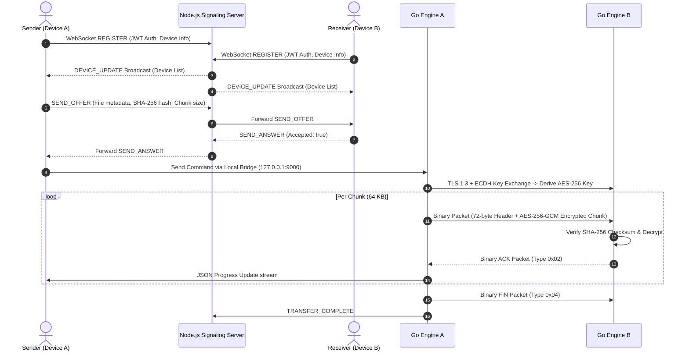

# Architecture Specification

## System Topology

The system separates control signaling from high-throughput binary file payload transfers.

---

## Binary Wire Protocol Specification

The Go Core Engine communicates over raw TCP using a **72-byte fixed binary header**:

| Field | Size | Type | Description |
|---|---|---|---|
| Version | 1 byte | `uint8` | Protocol version (`0x01`) |
| Type | 1 byte | `uint8` | `SYN (0x01)`, `ACK (0x02)`, `DATA (0x03)`, `FIN (0x04)`, `PAUSE (0x05)` |
| Flags | 2 bytes | `uint16` | Control flags |
| Transfer ID | 16 bytes | `[16]byte` | Unique transfer UUID bytes |
| Chunk Number | 8 bytes | `uint64` | Current chunk index |
| Total Chunks | 8 bytes | `uint64` | Total chunk count |
| Chunk Size | 4 bytes | `uint32` | Encrypted payload byte size |
| Checksum | 32 bytes | `[32]byte` | SHA-256 checksum of plaintext chunk |
| **Payload** | Variable | `[]byte` | AES-256-GCM encrypted payload data |

---

## NAT Traversal & Connectivity Flow

1. **Direct Connection Attempt**:
   - Both devices register their public and LAN IPv4 addresses with the signaling server.
   - Initial TCP socket connection is attempted directly on LAN IP or public IP:Port.
2. **Relay Fallback**:
   - If direct TCP connection times out due to strict NAT/firewall boundaries, both peers request a relay tunnel from the signaling server.
   - The payload remains AES-256-GCM encrypted end-to-end; the relay server only sees encrypted binary frames.
